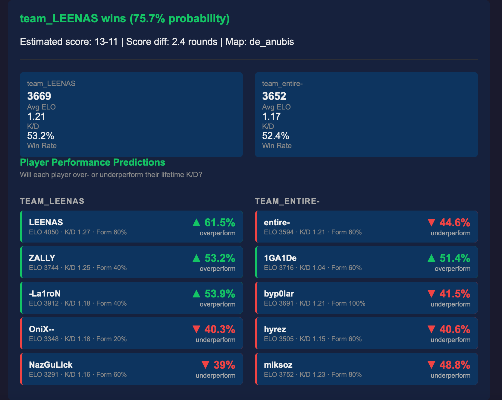

# CS2 Match Predictor
This project predicts probability of winning, difference of won/lost rounds and if players will overperform or underperform their lifetime k/d on FACEIT CS2 matches

## How it predicts
The project offers two choices how to predict the match:   
1. Pasting the URL of the match room

2. writing player nicknames


## Results
The results looks like this:

# Installation and setup

## prerequisites
- You need an FACEIT API key:
  - Create a account on FACEIT.com and verify your email.
  - Then log into developers.faceit.com
  - Create a app on the site and after that you will se the API key.


## setup
1. Clone the project or install the .zip file
2. Download the requirements
```commandline
pip install -r requirements.txt
```
3. create .env file containing the API key
```dotenv
FACEIT_API_KEY=YOUR_API_KEY
```
4. Run the app  
From the /ui folder (It can be also python3 instead of python)
```commandline
python app.py
```


